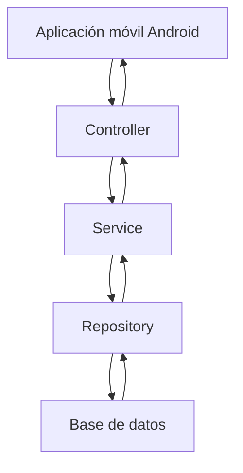
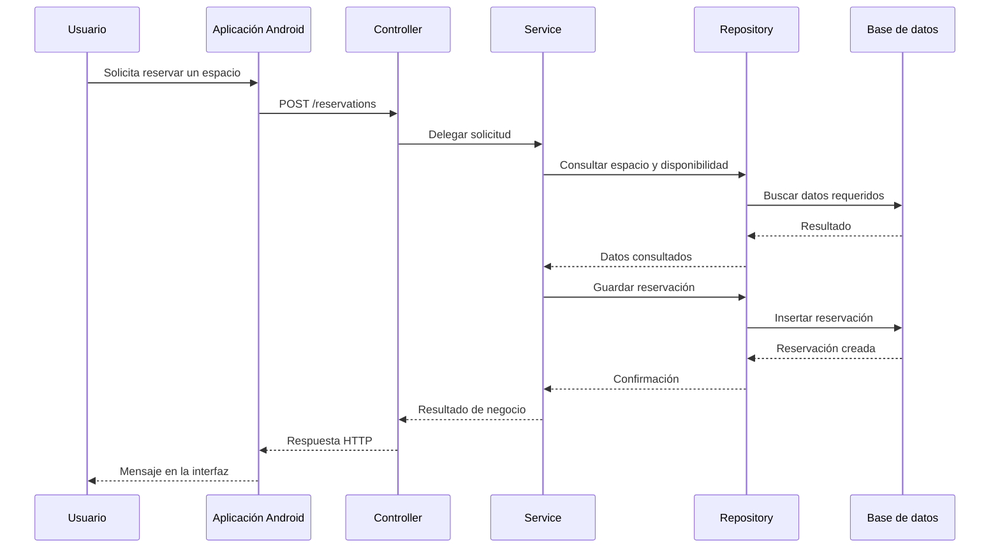

# Diseño Backend Conceptual

## 1. Arquitectura backend basada en capas

Para la aplicación de gestión de espacios de coworking se propone una arquitectura backend basada en capas. Esta arquitectura organiza el sistema separando responsabilidades entre la entrada de solicitudes, la lógica del negocio, el acceso a datos y la persistencia.

La estructura propuesta es:

Las capas principales del backend conceptual son:

* Controller
* Service
* Repository
* Database

Esta estructura permite que cada parte del sistema tenga una responsabilidad clara y evita mezclar lógica de presentación, reglas de negocio y acceso a datos en un mismo lugar.

## 2. Rol de cada capa

### Controller

La capa Controller es responsable de recibir las peticiones HTTP enviadas desde la aplicación móvil.

En el contexto de esta aplicación, los controllers atenderían operaciones como:

* Consultar espacios de coworking.
* Obtener el detalle de un espacio.
* Crear una reservación.
* Actualizar una reservación.

El controller no debe contener lógica de negocio compleja. Su función principal es recibir la solicitud, validar datos básicos de entrada y delegar el procesamiento a la capa Service.

Ejemplo conceptual:

* Recibir una petición `POST /reservations`.
* Validar que el cuerpo de la solicitud tenga los campos requeridos.
* Enviar la información al servicio de reservaciones.
* Devolver una respuesta HTTP adecuada al cliente.

### Service

La capa Service contiene la lógica principal del negocio.

En esta aplicación, los servicios serían responsables de aplicar reglas como:

* Verificar si un espacio existe.
* Validar si el espacio está disponible.
* Calcular el costo estimado de una reservación.
* Coordinar la creación o actualización de una reserva.
* Definir qué respuesta debe generarse según el resultado de la operación.

Esta capa permite que la lógica del sistema no quede dentro de los controllers ni dentro del acceso directo a la base de datos.

### Repository

La capa Repository se encarga de abstraer el acceso a los datos.

Su responsabilidad es comunicarse con la base de datos para consultar, crear, actualizar o eliminar información. El Service no debería conocer detalles internos de la base de datos, consultas SQL o implementación de persistencia; para eso utiliza el Repository.

En esta aplicación, los repositories podrían encargarse de:

* Buscar espacios de coworking por identificador.
* Listar espacios disponibles.
* Guardar reservaciones.
* Actualizar el estado de una reservación.
* Consultar disponibilidad de un espacio.

### Database

La base de datos almacena de forma persistente la información del sistema.

En una versión completa de la aplicación, la base de datos podría almacenar entidades como:

* Usuarios.
* Espacios de coworking.
* Reservaciones.
* Disponibilidad de espacios.
* Métodos de pago.
* Historial de reservas.

Para esta prueba de concepto no se implementa base de datos real, ya que el alcance del examen indica que se deben utilizar datos simulados y que no se requiere persistencia.

## 3. Flujo de una petición desde el cliente hasta la base de datos

El flujo conceptual de una petición para crear una reservación sería el siguiente:

1. El usuario selecciona un espacio de coworking desde la aplicación móvil.
2. El usuario presiona el botón para reservar.
3. La aplicación enviaría una petición HTTP al backend, por ejemplo `POST /reservations`.
4. El Controller recibe la solicitud.
5. El Controller valida la estructura básica del request.
6. El Controller delega la operación al Service.
7. El Service valida las reglas de negocio, como existencia del espacio y disponibilidad.
8. El Service solicita al Repository consultar o guardar información.
9. El Repository accede a la base de datos.
10. La base de datos devuelve el resultado de la operación.
11. El Repository retorna la información al Service.
12. El Service construye el resultado de negocio.
13. El Controller convierte ese resultado en una respuesta HTTP.
14. La aplicación móvil recibe la respuesta.
15. La interfaz muestra un mensaje de éxito o error al usuario.

Representación del flujo:

## 4. Justificación de decisiones

Se propone una arquitectura por capas porque el sistema puede crecer más allá de la prueba de concepto. Aunque en esta evaluación no se implementa backend real, la aplicación está orientada a una funcionalidad que naturalmente requiere validaciones, disponibilidad, usuarios y reservaciones.

Separar el backend en Controller, Service y Repository aporta las siguientes ventajas:

* **Mantenibilidad:** cada capa tiene una responsabilidad específica.
* **Escalabilidad:** se pueden agregar nuevas funciones sin desordenar el sistema.
* **Claridad técnica:** el flujo de una petición es fácil de entender.
* **Reutilización:** la lógica de negocio puede ser usada por diferentes endpoints.
* **Facilidad de prueba:** las reglas de negocio pueden probarse en la capa Service.
* **Separación de responsabilidades:** el controller no maneja reglas complejas y el service no depende directamente de consultas a la base de datos.

Esta estructura es coherente con el problema planteado porque una aplicación de coworking necesita consultar espacios, verificar disponibilidad y gestionar reservaciones. Estas operaciones requieren una separación clara entre la recepción de peticiones, las reglas de negocio y el acceso a datos.

## 5. Conclusión

El backend conceptual propuesto utiliza una arquitectura basada en capas para mantener una organización clara y profesional. Esta decisión permite que la aplicación pueda evolucionar desde una prueba de concepto con datos simulados hacia un sistema real con backend, base de datos, validaciones, disponibilidad y reservaciones persistentes.